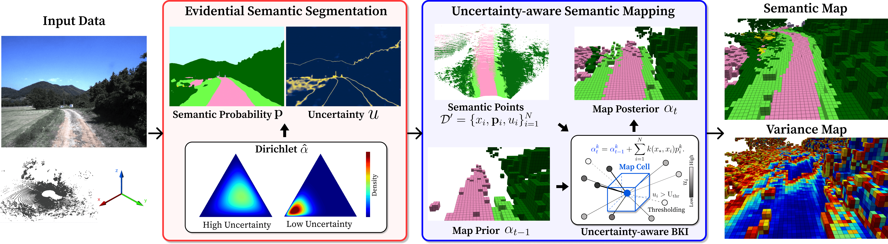

<div align="center">
    <h1>Uncertainty-aware Evidential Bayesian Semantic Mapping (EBS)</h1>
    </a>
    </a>
    <a href="https://github.com/url-kaist/patchwork-plusplus/tree/master/ros"></a>
    <a href="https://github.com/url-kaist/patchwork-plusplus/tree/master"></a>
    <br />
    <br />
    <a href="https://youtu.be/5cYY5c25GqE">Video (5min)</a>
    <span>&nbsp;&nbsp;•&nbsp;&nbsp;</span>
    <a href="https://youtu.be/91ct6I_8iXg">Video (1min)</a>
    <span>&nbsp;&nbsp;•&nbsp;&nbsp;</span>
    <a href="https://arxiv.org/abs/2403.14138">Paper</a>
    <span>&nbsp;&nbsp;•&nbsp;&nbsp;</span>
    <a href="https://kjyoung.github.io/Homepage/#/Projects/Evidential-Semantic-Mapping">Homepage</a>
    <br />
</div>

---

This is a repository for [Evidential Semantic Mapping in Off-road Environments with Uncertainty-aware Bayesian Kernel Inference](https://kjyoung.github.io/Homepage/#/Projects/Evidential-Semantic-Mapping) which is accepted for IROS 2024.   

<p align="center">
 
 <br />
 <em>Representative Qualitative Results of our framework</em>
</p>

# 🚧 Requirements
## Docker
### Prepare Docker Images
- You can pull our docker images from Docker Hub. We only tested our code under settings with: `Ubuntu 22.04`, `CUDA 11.6`, `ROS1-noetic`
- Docker Image for Semantic Segmentation: [Link](https://hub.docker.com/repository/docker/jykim157/ebs_semseg/general)
    - OR You can pull the image via `docker pull jykim157/ebs_semseg`
- Docker Image for Semantic Mapping: [Link](https://hub.docker.com/repository/docker/jykim157/rosbki/general)
    - OR You can pull the image via `docker pull jykim157/rosbki`

### Execute Docker Images
- Semantic Segmentation   
    ```docker run --rm -it --gpus=all -v {Your Workspace Directory}:/workspace -v {Your Data Directory}:/data --shm-size=16G --name {Container Name} jykim157/ebs_semseg```
- Semantic Mapping   
    ```docker run --rm -it --gpus=all --net=host -e DISPLAY --privileged  --device=/dev/dri:/dev/dri -v /tmp/.X11-unix:/tmp/.X11-unix -v {Your Workspace Directory}:/workspace/ --name {Container Name} jykim157/rosbki```

## Dataset
### Rellis-3D Dataset Configuration
Once you download the [RELLIS-3D dataset](https://github.com/unmannedlab/RELLIS-3D) in your workspace, our framework assumes the following directory structures.   

**Main Data**  
<pre>
RELLIS_ROOT
└── {00000, 00001, 00002, 00003, 00004}
      ├── os1_cloud_node_kitti_bin/                  -- directory containing ".bin" files with Ouster 64-Channels point clouds.   
      ├── pylon_camera_node/                         -- directory containing ".jpg" files from the color camera.  
      ├── pylon_camera_node_label_color              -- directory containing ".png" files: color image lable
      └── poses.txt             -- file containing the poses of every scan.
</pre>

**Camera Intrinsic**
<pre>
RELLIS_CAMERA_INFO
└── {00000, 00001, 00002, 00003, 00004}
      └──  camera_info.txt
</pre>

**Basler Camera to Ouster LiDAR**
<pre>
RELLIS_TRANSFORM
└── {00000, 00001, 00002, 00003, 00004}
      └──  transforms.yaml
</pre>

### (Optional) RUGD Dataset Configuration
Once you download the RUGD dataset in your workspace, our framework assumes the following directory structures.   
   
**Main Data**  
<pre>
RUGD_ROOT
├── RUGD_frames-with-annotations  -- directories containing images
├── RUGD_annotations              -- directories containing labels
</pre>

### (Optional) Custom Ros bag Data
If you operate on your own custom ros bag data, you might process your `.bag` file, then save your `LiDAR`, `Image`, and `Pose` information separately. The easiest way would be adopting the format of RELLIS-3D dataset. In short, the `numpy` format of 3D point cloud is suggested (i.e., `N x K` numpy matrix where N is the number of points and K >= 3 is the number of field for each point. In general, there are various additional fields such as `intensity`. However, our framework only utilize `(x, y, z)` fields).    

# 🔥 How to Use

<p align="center">
 
 <br />
 <em>Our overall framework for constructing semantic maps</em>
</p>

You can read more detailed information from the `README.md` file for each directory.   

## 1. EvSemSeg     (Train + Inference + Prepare)
**Goal**: Train an EDL-trained semantic segmentation model, and obtain semantic probability map and its corresponding uncertainty map in 2D image.
- Using docker image `jykim157/ebs_semseg`
- [**Train**] Given 2D (Image, Label) pairs, train a sementic segmentation model
- [**Prep**]  Given the trained semantic segmentation model, inference for making 2D semantic segmentation results.
    - With `--model evidential`, prep mode will yield evidence vector in `.npy` format.

## 2. Projection   (Projection)
**Goal**: Project (or Lift) semantic probability map and uncertainty map into 3D space via 3D point clouds.
- Using docker image `jykim157/ebs_semseg`
- Given (2D Semantic Segmentation Results, LiDAR, Pose) dataset, project those 2D results onto the 3D point cloud and transform them into the global coordinate system.   

## 3. Semantic Map (Data Processing + Building Semantic Maps)
**Goal**: Given semantic points, construct a semantic map with its corresponding uncertainty map.
- Using docker image `jykim157/rosbki`
- Format `numpy` point cloud type to the `pcd` point cloud type via `roslaunch evsemmap pcd_conversion.launch`
- Given semantic (or evidential) points, build semantic map via `roslaunch evsemmap mapping.launch dataset:={DATASET} method:={METHOD} result_name:={OUTPUT_DIR}`
    - Example command: `roslaunch evsemmap mapping.launch dataset:=deploy_rellisv3_4_1-30 method:=ebs result_name:=/workspace/deployTest/`
    - You can choose `dempster`, `ebs`, `sbki` methods.
        - `dempster`: the method using Dempster-Shafer Theory of Evidence, which was presented in [ICRA 2024 Workshop](https://theairlab.org/icra2024_offroad_workshop/). [(paper)](https://arxiv.org/pdf/2405.06265)
        - `ebs` : the method proposed in IROS 2024. [(paper)](https://arxiv.org/pdf/2403.14138)
        - `sbki` : the baseline method. [(paper)](https://ieeexplore.ieee.org/abstract/document/8954837)
    - You can modify parameters or add new config files in `SemanticMap/src/SemanticMap/config/datasets/*.yaml` or `SemanticMap/src/SemanticMap/config/methods/*.yaml`.

# 🔎 Results
## Qualitative Results

<p align="center">
 
 <br />
 <em>Qualitative Results in RELLIS-3D dataset</em>
</p>

<p align="center">
 
 <br />
 <em>Qualitative Results in our off-road dataset</em>
</p>

## Quantitative Results

<p align="center">
 
 <br />
 <em>Quantitative Results</em>
</p>

# 🖇️ Acknowledgement
We utilize the data and code from various works:
1. [RELLIS-3D](https://github.com/unmannedlab/RELLIS-3D)
2. [RUGD](http://rugd.vision/)
3. [S-BKI](https://github.com/ganlumomo/BKISemanticMapping)
4. [SEE-CSOM](https://github.com/BIT-DYN/SEE-CSOM)
5. [ConvBKI](https://github.com/UMich-CURLY/BKI_ROS)
6. [EvPSNet](https://github.com/kshitij3112/EvPSNet)

# 📝 Citation
If you use our codes or find our work useful in your research work, consider citing [our paper](https://arxiv.org/abs/2403.14138).   
You can also find additional information in our [project website](https://kjyoung.github.io/Homepage/#/Projects/Evidential-Semantic-Mapping).   

**IROS2024**
```
@article{kim2024evidential, 
    title={Evidential Semantic Mapping in Off-road Environments with Uncertainty-aware Bayesian Kernel Inference},
    author={Kim, Junyoung and Seo, Junwon and Min, Jihong},
    journal={IEEE/RSJ International Conference on Intelligent Robots and Systems (IROS)},
    year={2024}
}
```

**ICRA2024 Workshop**
```
@article{kim2024uncertainty, 
    title={Uncertainty-aware Semantic Mapping in Off-road Environments with Dempster-Shafer Theory of Evidence},
    author={Kim, Junyoung and Seo, Junwon},
    journal={ICRA 2024 Workshop on Resilient Off-road Autonomy},
    year={2024}
}
```
